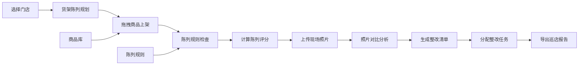

## 1. 产品概述

智慧零售货架陈列纯前端应用，供品牌督导在浏览器中规划门店货架与促销位，提升陈列效率与合规性，实现标准化巡店与数字化管理。

- 核心用途：货架陈列规划、陈列合规检查、巡店整改追踪
- 目标用户：品牌督导、门店店长、陈列专员
- 产品价值：标准化陈列管理、降低督导巡店成本、提升陈列执行效率

## 2. 核心功能

### 2.1 用户角色

| 角色 | 使用场景 | 核心权限 |
|------|----------|----------|
| 品牌督导 | 巡店检查、陈列规划、生成报告 | 全部功能、导出报告、分配整改 |
| 门店店长 | 查看整改、执行陈列 | 查看陈列方案、标记整改完成 |

### 2.2 功能模块

1. **门店选择区**：门店列表、搜索筛选、模板复制
2. **货架画布区**：货架可视化、层板配置、拖拽陈列、端架堆头标记
3. **商品库**：商品分类筛选、商品卡片、库存提醒、搜索
4. **陈列规则**：相邻品牌限制、排面计算、规则检查、评分
5. **照片对比**：上传现场照片、标准图对比、差异标注
6. **整改清单**：整改项列表、分配店员、完成时间、状态追踪
7. **导出页**：巡店报告生成、评分展示、PDF/图片导出

### 2.3 页面详情

| 区域名称 | 模块名称 | 功能描述 |
|-----------|-------------|---------------------|
| 门店选择 | 门店列表 | 展示所有门店，支持搜索、按区域筛选 |
| 门店选择 | 模板管理 | 复制门店模板、保存为模板、应用模板 |
| 货架画布 | 货架视图 | 多面货架切换、层板高度调节、端架/堆头标记 |
| 货架画布 | 商品陈列 | 拖拽商品上架、调整位置、排面数量计算 |
| 商品库 | 分类筛选 | 按品类、品牌、规格筛选商品 |
| 商品库 | 商品卡片 | 展示商品图、名称、规格、库存状态 |
| 陈列规则 | 规则配置 | 相邻品牌限制、必陈商品、禁陈区域 |
| 陈列规则 | 合规检查 | 实时检查陈列合规性、计算陈列评分 |
| 照片对比 | 照片上传 | 支持本地图片上传、多图管理 |
| 照片对比 | 对比视图 | 左右分屏对比、叠加对比、标准图参考 |
| 整改清单 | 整改项管理 | 添加/编辑整改项、分配责任人、设置截止时间 |
| 整改清单 | 状态追踪 | 待处理/进行中/已完成状态、完成时间记录 |
| 导出页 | 报告生成 | 汇总陈列评分、整改项、照片生成巡店报告 |
| 导出页 | 导出功能 | 支持导出为 PDF/图片格式 |

## 3. 核心流程

### 3.1 主用户流程

品牌督导进入应用后，选择目标门店，在货架画布上通过拖拽商品库中的商品进行陈列规划，系统实时根据陈列规则检查合规性并计算评分。巡店时上传现场照片与标准陈列图对比，发现问题生成整改项并分配给店员，最后导出巡店报告。

### 3.2 流程图

## 4. 用户界面设计

### 4.1 设计风格

- **主色调**：深蓝 `#1e3a5f` 作为主色，搭配橙色 `#ff6b35` 作为强调色
- **辅助色**：浅灰 `#f5f7fa` 背景、中灰 `#e4e7ed` 边框、深灰 `#303133` 文字
- **按钮风格**：圆角矩形、悬浮微阴影、点击下沉效果
- **字体**：标题使用 "Noto Sans SC" 粗体，正文使用系统无衬线字体
- **布局风格**：多面板工具式布局，左侧商品库 + 中间画布 + 右侧属性面板
- **图标风格**：线性图标为主，关键操作使用面性图标强调

### 4.2 页面设计概览

| 区域名称 | 模块名称 | UI 元素 |
|-----------|-------------|----------|
| 顶部导航 | 门店选择 | 下拉选择器、门店名称、当前评分 |
| 左侧面板 | 商品库 | 分类标签、搜索框、商品卡片网格、库存标签 |
| 中间主区 | 货架画布 | 货架示意图、层板分隔线、商品陈列位、拖拽指示 |
| 右侧面板 | 属性/规则 | 层板设置、规则检查结果、评分展示、整改列表 |
| 底部工具栏 | 操作栏 | 照片对比、整改清单、导出按钮、视图切换 |

### 4.3 响应式设计

- 桌面端优先设计（1440px+）
- 平板端：左右面板可折叠，画布自适应
- 移动端：单列布局，面板改为抽屉式
- 触摸优化：拖拽区域加大，按钮最小 44px

### 4.4 动效设计

- 页面加载：面板渐入 + 轻微位移
- 拖拽交互：半透明预览、位置指示线
- 状态切换：平滑过渡动画（0.3s ease）
- 提醒反馈：轻微震动 + 颜色变化
- 悬浮效果：卡片微上浮 + 阴影加深
