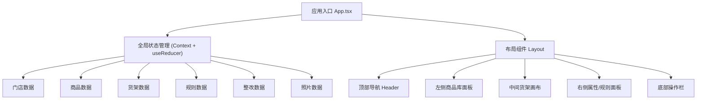
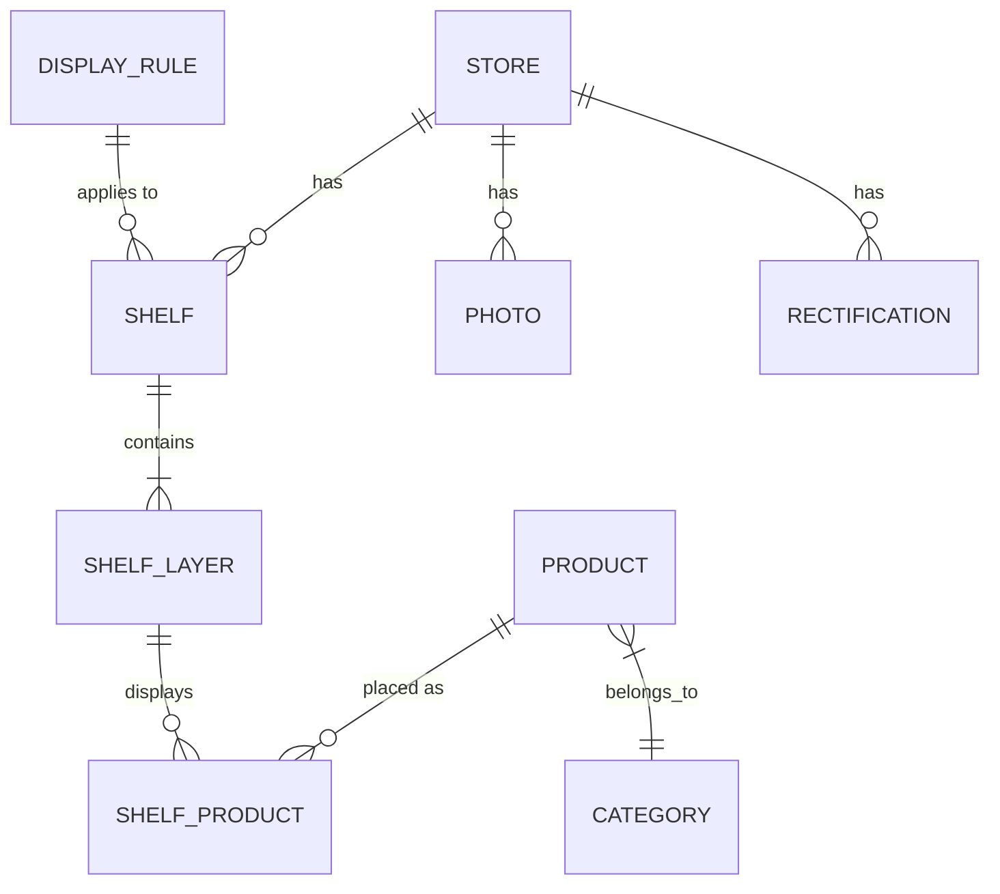

## 1. 架构设计



## 2. 技术说明

- **前端框架**：React@18 + TypeScript
- **构建工具**：Vite@5
- **样式方案**：TailwindCSS@3 + CSS 变量
- **状态管理**：React Context + useReducer（全局状态） + useState（组件状态）
- **拖拽方案**：原生 HTML5 Drag and Drop API
- **图标库**：Lucide React
- **后端**：无（纯前端，Mock 数据）
- **数据存储**：LocalStorage（可选持久化）
- **导出功能**：html2canvas + jspdf（客户端生成 PDF/图片）

## 3. 模块/组件划分

| 路径 | 组件/模块 | 职责 |
|------|-----------|------|
| `src/App.tsx` | App | 应用入口，全局状态提供者 |
| `src/layout/` | Layout | 整体布局框架 |
| `src/components/Header/` | Header | 顶部导航、门店选择、评分展示 |
| `src/components/ProductLibrary/` | ProductLibrary | 商品库、分类筛选、商品卡片 |
| `src/components/ShelfCanvas/` | ShelfCanvas | 货架画布、层板、商品陈列位、拖拽处理 |
| `src/components/RulePanel/` | RulePanel | 陈列规则、合规检查、评分详情 |
| `src/components/PhotoCompare/` | PhotoCompare | 照片上传、对比视图 |
| `src/components/RectificationList/` | RectificationList | 整改清单、分配、状态追踪 |
| `src/components/ExportPanel/` | ExportPanel | 导出报告、预览 |
| `src/store/` | Store | 全局状态 Context、Reducer、Action 类型 |
| `src/data/` | Mock Data | 门店、商品、规则等模拟数据 |
| `src/types/` | Types | TypeScript 类型定义 |
| `src/utils/` | Utils | 规则检查、排面计算、导出等工具函数 |
| `src/hooks/` | Hooks | 自定义 Hooks（拖拽、本地存储等） |

## 4. 核心数据模型

### 4.1 类型定义

```typescript
// 门店
interface Store {
  id: string;
  name: string;
  address: string;
  region: string;
  templateId?: string;
}

// 商品
interface Product {
  id: string;
  name: string;
  category: string;
  brand: string;
  spec: string;
  image: string;
  width: number;   // 排面宽度（单位）
  stock: number;
  stockWarning: boolean;
}

// 货架
interface Shelf {
  id: string;
  name: string;
  type: 'normal' | 'end' | 'display'; // 普通、端架、堆头
  layers: ShelfLayer[];
}

// 货架层板
interface ShelfLayer {
  id: string;
  height: number;      // 层板高度 cm
  position: number;    // 垂直位置
  products: ShelfProduct[];
}

// 货架上的商品
interface ShelfProduct {
  productId: string;
  position: number;    // 水平位置
  facings: number;     // 排面数
}

// 陈列规则
interface DisplayRule {
  id: string;
  type: 'adjacent_brand' | 'must_have' | 'forbidden_area' | 'facing_min';
  description: string;
  params: Record<string, any>;
}

// 整改项
interface Rectification {
  id: string;
  title: string;
  description: string;
  assignee: string;
  status: 'pending' | 'in_progress' | 'completed';
  createdAt: string;
  dueDate: string;
  completedAt?: string;
  photoRef?: string;
}

// 照片
interface Photo {
  id: string;
  url: string;
  type: 'standard' | 'onsite';
  shelfId?: string;
  uploadTime: string;
}
```

### 4.2 数据实体关系图



## 5. 核心算法/逻辑

### 5.1 排面计算
- 根据商品宽度和层板总宽度计算可放置的最大排面数
- 支持多商品混排的位置计算
- 拖拽时实时计算目标位置是否可容纳

### 5.2 陈列规则检查
- 相邻品牌限制：检查左右相邻商品的品牌是否在禁用列表中
- 必陈商品检查：检查指定商品是否在对应位置陈列
- 禁陈区域检查：检查禁陈区域是否有商品
- 最少排面检查：检查关键商品排面数是否达标
- 实时计算陈列评分（百分制）

### 5.3 拖拽逻辑
- 商品库 → 货架：新增商品陈列
- 货架内拖动：调整商品位置和排面
- 货架 → 外部：移除商品
- 支持批量拖拽（多选）

## 6. 导出方案

- **PDF 导出**：使用 jspdf + html2canvas 客户端生成
- **图片导出**：使用 html2canvas 生成 PNG
- **报告内容**：门店信息、陈列评分、货架方案图、整改清单、照片对比
